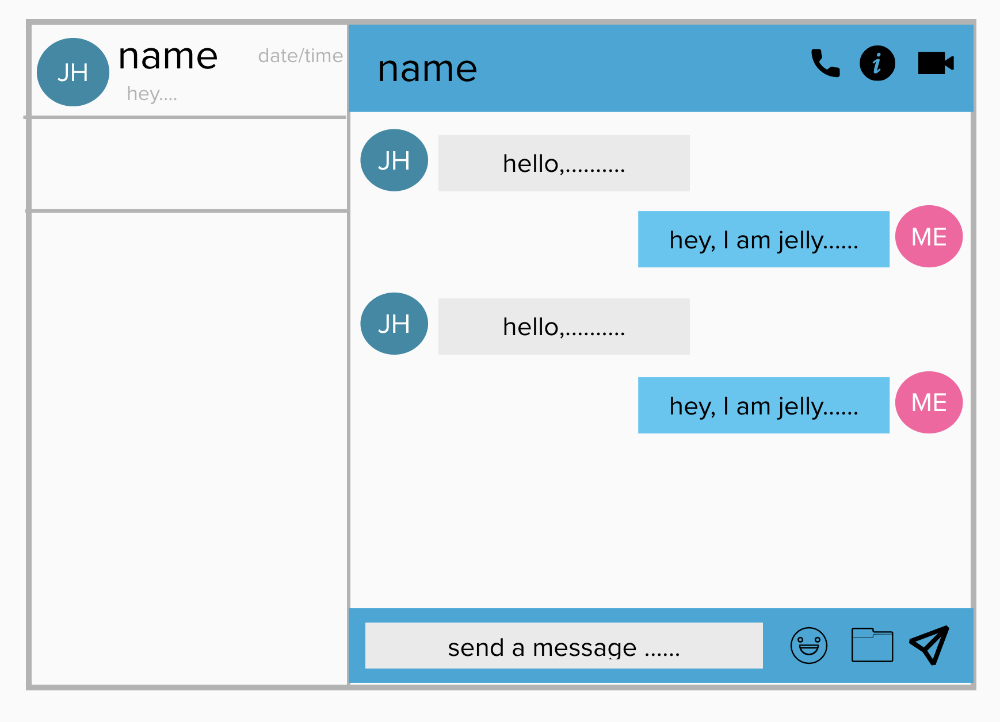
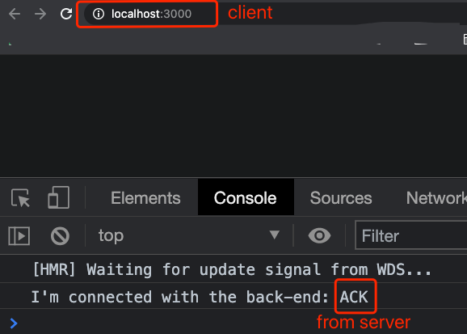
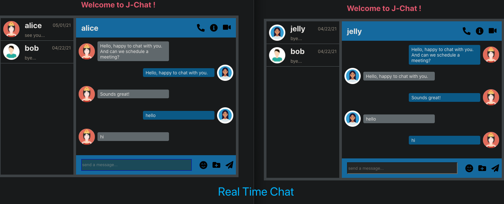

## React Chat App with socket.io

#### I. [UI Design](#chapter1)

#### II. [Build Front-end & Connect to Server](#chapter2)

#### III. [Complete Chat App on client side](#chapter3)

#### IV. [Adding the Logics](#chapter4)

- [4.1 resolve CORS issue on Express.js](#ch4-1)
- [4.2 Safely Send JSON data back to client](#ch4-2)
- [4.3 Setup Socket-client and how to Persist?](#ch4-3)
- [4.4 Socket.io: Rooms - chat channels](#ch5-4)

#### V. [Optimize Features](#chapter5)

- [5.1 react-router for login & chat ](#ch5-1)
- [5.2 simple Node.js Auth API](#ch5-2)
- [5.3 manage UserContext in whole app](#ch5-3)
- [5.4 User Typing event](#ch5-4)
- [5.5 Custom Hooks - login & chat](#ch5-5)

#### V. [Run the Code & Demo](#chapter6)

<div id="chapter1" />

### I. UI Design

After reference to multiple chat app layouts:

- wechat
- [react-chat-engine](https://chatengine.io/docs/getting_started) - UI docs
- Youtube: [How To Make Message Box Using HTML And CSS](https://youtu.be/EW9I1HqaKwk?list=PLrQr6RWWIK7cqzj7623DShBNkgfDO8F_k&t=1183)

Finalized my own chat app:



<div id="chapter1" />

### I. Setup the Server Side basics

Docs: [server initialization](https://socket.io/docs/v3/server-initialization/)

**Init npm project:**

```
npm init --y
```

**Install Dependencies:**

```
npm i --save express;
npm i --save socket.io;
```

**Initial Code on Server:**

```js
var app = require("express")();
const server = require("http").createServer();
const io = require("socket.io")(server, {
  cors: {
    origin: "*"
  }
});
const PORT = 8080;

server.listen(PORT, () => {
  console.log(`listening on *:${PORT}`);
});

io.on("connection", (socket) => {
  /* socket object may be used to send specific messages to the new connected client */
  console.log("new client connected");
});
```

<div id="chapter2" />

### II. Build Front-end & Connect to Server

#### 2.1 Build Front-end

**Install socket.io-client:**

Docs: [Client Installation](https://socket.io/docs/v3/client-installation/)

```bash
npm i socket.io-client
```

**React code integration:**

```js
import { io } from "socket.io-client";

const SERVER = "http://localhost:8080/";
const socket = io(SERVER);
```

**Server & Client socket connection:**

- Server side: [emit events](https://socket.io/docs/v3/emitting-events/)
- Client side: can receive data from the socket

```js
// server
io.on("connection", (socket) => {
  console.log("new client connected");
  socket.emit("connection", "ACK");
});

// client
socket.on("connection", (arg) => {
  console.log(`I'm connected with the back-end: ${arg}`);
});
```

UI results on client (browser):



<div id="chapter3" />

### III. Complete Chat App on client side

**Components:**

- chatbox
- chatlist
- chatlist-item
- chatpanel
- message

SVG - Icons: [fontawesome-icons](https://fontawesome.com/icons?d=gallery&p=2&m=free)

Final UI finished:



<div id="chapter4" />

### IV. Adding the Logics

<div id="ch4-1" />

#### 4.1 resolve CORS issue on Express.js

**Docs:** [express.js - cors](https://expressjs.com/en/resources/middleware/cors.html)

Install:

```bash
npm install cors
```

**Config cors with multiple domains:**
reference article: [Handle CORS in express.js](https://flaviocopes.com/express-cors/)

```js
var cors = require("cors");
// Cors Config
const whitelist = ["http://localhost:3000", "http://localhost:3001"];
const corsOptions = {
  origin: function (origin, callback) {
    if (whitelist.indexOf(origin) !== -1) {
      callback(null, true);
    } else {
      callback(new Error("Not allowed by CORS"));
    }
  }
};
```

Adding the http GET call to **send data back to client:**

```js
app.get("/getChatList", cors(corsOptions), (req, res) => {
  res.json(some - data);
});
```

<div id="ch4-2" />

#### 4.2 Safely send JSON data back to client

**Problem:** extra white spaces in URL in json object.
Note: `"https:white-space//www.some-domain.com......"`
Wrong:

```
{
	"url": "https: //www.some-domain.com/....",
}
```

Expected:

```
{
	"url": "https://www.some-domain.com/....",
}
```

**Solution:**
`JSON.stringify` before node.js server send it.

```js
var chatlist = require("./chat-list.json");
const data = {
  list: JSON.stringify(chatlist)
};
app.get("/getChatList", cors(corsOptions), (req, res) => {
  res.json(data);
});
```

**Solution2:**
Read a json file, and use `JSON.parse(data)`, before send it back to client.
Reference article: [link1-stackoverflow](https://stackoverflow.com/questions/10011011/using-node-js-how-do-i-read-a-json-file-into-server-memory), [read & write JSON file with Node.js](https://stackabuse.com/reading-and-writing-json-files-with-node-js/)

```js
app.get("/getChatList", cors(corsOptions), (req, res) => {
  fs.readFile("./chat-list.json", (err, data) => {
    if (err) throw err;
    var dt = JSON.parse(data);
    res.json(dt);
  });
});
```

<div id="ch4-3" />

#### 4.3 Setup Socket-client and how to Persist?

- in `componentDidMount()`, only set once
- remember to `clear/destroy` the socket in `componentWillUnMount()` - **SAME** in **Functional** component
- socket event:
  - `emit('event_name', ...args)`: [docs](https://socket.io/docs/v3/client-initialization/)
  - `on('event_name', callback)`
- How to **persist** the single instance of "socket-client"?
`useRef` returns a mutable ref object whose `.current` property is initialized to the passed argument (`initialValue`). The returned object will persist for the full lifetime of the component. - [useRef()](https://reactjs.org/docs/hooks-reference.html#useref)
<div id="ch4-4" />

#### 4.4 Socket.io: Rooms - chat channels

- a channel with any NO of people is a room, same `roomID`
- here: any 2 people chat is a room
- Docs: [sockit.io - rooms](https://socket.io/docs/v3/rooms/)

**Client side:**

```js
socket = socketIOClient(SOCKET_SERVER_URL, {
  query: { roomId }
});
```

**Server side:**

- `io.join(roomID)`: [docs](https://socket.io/docs/v3/rooms/#Joining-and-leaving)
- `io.in(roomID)` : find and enter that specific room id
- `io.leave(roomID)` : [docs](https://socket.io/docs/v3/rooms/#Joining-and-leaving)

```js
serverIO.on("connection", (socket) => {
  // Join a conversation
  const { roomId } = socket.handshake.query;
  socket.join(roomId);

  // enter a room and broadcast
  io.in(roomId).emit("event_name", data);

  // Leave the room if the user closes the socket
  socket.on("disconnect", () => {
    socket.leave(roomId);
  });
});
```

<div id="chapter5" />

### V. Optimize Features

<div id="ch5-1" />

#### 5.1 react-router for login & chat

**Define my paths:**

```js
// in App.js
<Switch>
  <Route path="/chat">
    <ChatBox />
  </Route>
  <Route path="/login">
    <Login />
  </Route>
  <Route path="/">
    <Login />
  </Route>
</Switch>
```

**Redirect when login sucess:**

**Docs:** [withRouter()](https://reactrouter.com/web/api/withRouter), [redirect in react-router-stackoverflow](https://stackoverflow.com/questions/34735580/how-to-do-a-redirect-to-another-route-with-react-router)

```js
import { withRouter } from "react-router";

const Login = ({ history }) => {};

export default withRouter(Login);
```

**Docs:** [useHistory() hook](https://reactrouter.com/web/api/Hooks/usehistory)

```js
import { useHistory } from "react-router-dom";
const history = useHistory();
```

<div id="ch5-2" />

#### 5.2 Very Simple Server side Auth API

Add endpoint to get back current User ID:

```
http://localhost:8000/auth/${queryName}
```

<div id="ch5-3" />

#### 5.3 manage UserContext in whole app

**Docs:** [how to manage userContext](https://www.digitalocean.com/community/tutorials/react-manage-user-login-react-context), [useContext - react docs](https://reactjs.org/docs/hooks-reference.html#usecontext)

**1) Create my context:**

```js
const userContext = React.createContext({
  myid: null,
  setMyId: () => {}
});
```

**2) Create Provider:**

```jsx
// app.js
import UserContext from "src/context/UserContext";
return (
  <UserContext.Provider
    value={{
      myId: id,
      setMyId: setId
    }}
  >
    // ...
  </UserContext.Provider>
);
```

**3) Create Consumer :**

```jsx
// in component.js
import { useContext } from "react";
import UserContext from "src/context/UserContext";
const userContext = useContext(UserContext);
```

<div id="ch5-4" />

#### 5.4 User Typing event

- start typing: `onKeyDown` event in react
- stop typing: `onKeyUp` event in react
- Remember to **debounce()** for each handler
  ```js
  const debounce = (fn, delay) => {
    let timer;
    return function (...args) {
      clearTimeout(timer);
      timer = setTimeout(() => {
        clearTimeout(timer);
        fn(...args);
      }, delay);
    };
  };
  ```
- Also need to **useCallback()** on each handler **in react**-
  ```js
  keyDownHandler = useCallback(debounce(keyDownHandler, 500), [
    dependency - list
  ]);
  keyUpHandler = useCallback(debounce(keyUpHandler, 500), [dependency - list]);
  ```
- socket event for typing both on **client & server side**
  - `socket.on('user-typing', .....)`
  - `socket.on('stop-typing', .....)`

<div id="ch5-5" />

#### 5.5 Custom Hooks - login & chat

Clean code in UI components, here two major use-case:

- Login Component
  Extract all logic parts outside of this component, and keep code clean and easy to read.
  ```js
  const  Login = () => {
  	const { form, error, onInputChangeHandler, onSubmitHandler } = useLogin();
  	return (.....);
  };
  ```
- Chat component
  Wrap all **Socket-related** state and handlers **internally inside the hook**, only **expose user-ui** related logic.
  ```js
  const {
    inputMsg,
    setInputMsg,
    inputHandler,
    renderMsgs,
    userTyping,
    keyDownHandler,
    keyUpHandler,
    btnClickSubmitHanlder
  } = useChat(selectedUser);
  ```

<div id="chapter6" />

### VI. How to Run the Code?

- sever: `node sever.js`
  **Note**: add your own domain URL to **CORS whitelist if needed**
- client: `npm start`, use the **reminder userInfo** to **login**
- **Test**: you need to run two different application on local browser to test 2 users

**Demo:**


**Github link:** [react-chat-app-socketio](https://github.com/jialihan/react-chat-app-socketio/)
